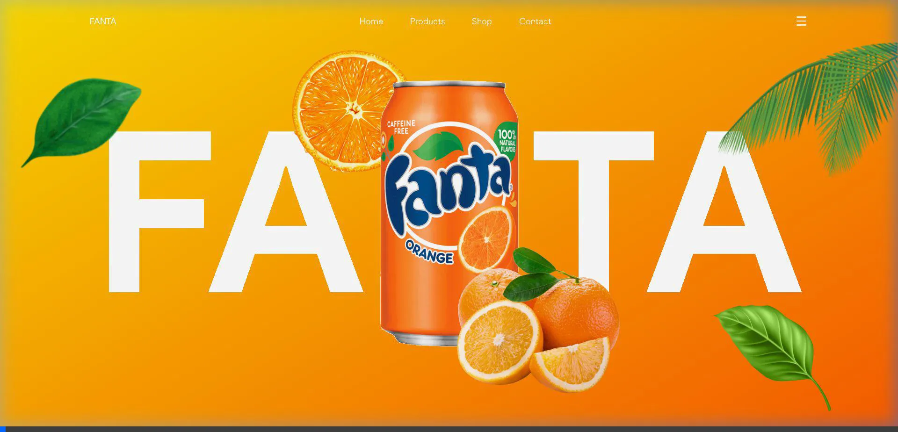

# FANTA ANIMATIONS

A mesmerizing, high-performance scrollytelling web experience built for Fanta. This project showcases stunning scroll animations using HTML, CSS, JavaScript, and the incredible GSAP (GreenSock Animation Platform) library, along with the ScrollTrigger plugin.



## 🌟 Features

- **Cinematic Scroll Animations**: Smooth, high-performance scroll interactions powered by GSAP's ScrollTrigger.
- **Dynamic 3D-like Effects**: Images scale, rotate, and transition seamlessly as you scroll through the sections.
- **Multi-Brand Showcase**: Interactive animations featuring Fanta, Coca Cola, and Pepsi.
- **Responsive Navigation**: A clean, modern top navigation bar.
- **Fully Custom Styling**: No external CSS frameworks—pure vanilla CSS with a custom design system.

## 🛠️ Technologies Used

- **HTML5**: Semantic structure for the web app.
- **CSS3**: Advanced styling, flexbox, grid, and modern gradients.
- **JavaScript (ES6)**: Core logic and animation orchestration.
- **GSAP (GreenSock Animation Platform)**: The industry standard for high-performance animations.
- **GSAP ScrollTrigger**: Plugin to synchronize animations with user scroll behavior.
- **Remix Icon**: Open-source icon library for UI elements.

## 🚀 How to Run Locally

You don't need any complex build tools to run this project. Simply serve the files using a local web server.

### Using Python:
```bash
python -m http.server 3000
```
Then open `http://localhost:3000` in your browser.

### Using Node.js:
```bash
npx serve -p 3000
```
Then open `http://localhost:3000` in your browser.

## 📬 Contact & Connect

Feel free to reach out or connect with me!

- 📞 **Phone**: 8810894778
- 📧 **Email**: [akhtarashhab@gmail.com](mailto:akhtarashhab@gmail.com)
- 💼 **LinkedIn**: [Ashhab Akhtar](https://www.linkedin.com/in/ashhab-akhtar-58820b253?utm_source=share_via&utm_content=profile&utm_medium=member_android)
- 📸 **Instagram**: [@_ashhabakhtar_](https://www.instagram.com/_ashhabakhtar_?igsh=MWlrczZ0czF6a3ozMg==)
